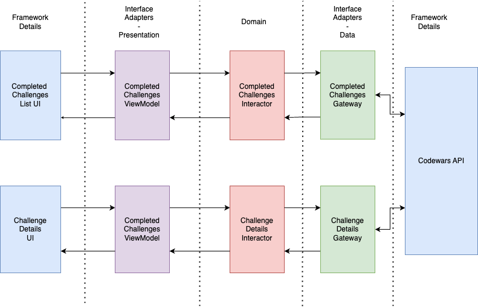

# TUI-Challenge

# Architecture Overview

The implementation of the project follows Clean Architecture principles.
In the domain layer we have the two main domain entities, CompletedChallenges and ChallengeDetails. Those entities are managed and handled by interactors, which are the implementation of the use cases of the app.
There is an interactor to handle `CompletedChallenges`, `CompletedChallengesInteractor` which exposes the use case of fetching the list of completed challenges for a given user. There is also an interactor to handle `ChallengeDetails`, `ChallengeDetailsInteractor` which exposes the use case of fetching the details of a given challenge. 
I opted to make the interactors into state machines that contain a representation of the current state of the application and expose a `Flow` of states to the presentation layer, inspired by MVI/Redux and Jake Wharton's talk [Managing State with RxJava](https://www.youtube.com/watch?v=0IKHxjkgop4). 

The domain layer also contains the definition of interfaces that the use cases use to fetch/store data somewhere. These interfaces are `CompletedChallengesGateway` and `ChallengeDetailsGateway`

Those interfaces are implemented in the Interface Adapters layer, responsible for providing a concrete implementation to the domain needs declared in the interfaces above mentioned.
It is in this layer that we use real implementations from the framework, namely  Retrofit to fetch data from the network.

In the Presentation layer, which also belongs to the Interface Adapters layer, I used AAC ViewModel but any pattern (MVP, MVC, MVI, etc.) would fit here.
In the UI layer, which belongs to the framework details, I used Jetpack Compose.

Below is a diagram of an overview of the architecture

# Testing strategy
I opted to implement two types of tests, Unit and Component (more details: https://martinfowler.com/bliki/ComponentTest.html).
During the development I used TDD which guided the way I implemented most things and had the side effect of producing a lot of unit tests. I started by the domain layer and went outwards.
The component tests were implemented later to validate the acceptance criteria of the requirements asked.

# Decisions Made

- The UI is very basic, since I suck at coming up with good designs :sweat_smile: and because I chose to focus on architecture and tests.
- I did not deal with screen rotation, since it wasn't asked and I didn't want to spend time on it. It could be implemented with `SavedStateHandle` in `ViewModel` and we can discuss it in the interview.
